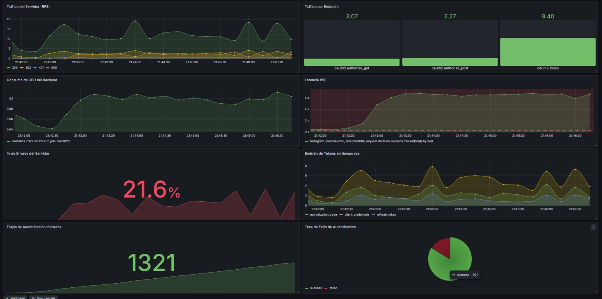

# Cloud-Native Identity & Observability: OAuth2 + Prometheus

<div align="center">

  
  
  
  
  

</div>

> **ABOUT THIS PROJECT:**
> This repository demonstrates a complete **DevSecOps** and **Site Reliability Engineering (SRE)** loop. It bridges the gap between Application Security (building a custom OAuth2 Authorization Server compliant with **RFC 6749**) and Cloud-Native Observability (Prometheus & Grafana).
>
> Furthermore, it integrates **Locust** for Chaos Engineering and Load Testing, simulating massive concurrent traffic to validate API resilience and generate real-time metrics under stress.

<div align="center">
  
</div>

---

## Architecture & Key Features

* **Identity & Access Management (OAuth2 — RFC 6749):** Custom modular backend (`oauth2_routes.py`, `admin_routes.py`) acting as a secure identity provider implementing the **Authorization Code**, **Client Credentials**, and **Refresh Token** flows, with encrypted token generation and SQLite persistence via ORM (`models.py`).
* **Cloud-Native Telemetry:** The application exposes a custom `/metrics` endpoint, instrumented to feed **Prometheus** (Pull-based telemetry) with data regarding HTTP response codes, latency, and active connections.
* **Load Testing & Chaos Engineering:** Integrated **Locust** scripts simulate concurrent traffic and authorization flows, allowing for resilience testing and capacity planning.
* **Modern Dependency Management:** Utilizes `pyproject.toml` and `uv` for lightning-fast, reproducible dependency resolution.

---

## Project Structure

```text
Cloud-Native-OAuth2-Observability
 ┣ 📂 assets/          
 ┃ ┗ 🖼️ dashboard.png
 ┣ 📂 docs/         
 ┃ ┣ 📜 presentation_slides.pdf
 ┃ ┗ 📜 technical_report.pdf
 ┣ 📂 grafana/         
 ┃ ┗ 📜 dashboard.json
 ┣ 📂 load-testing/   
 ┃ ┗ 📜 locustfile.py
 ┣ 📂 prometheus/     
 ┃ ┗ 📜 prometheus.yml
 ┗ 📂 src/         
   ┣ 📜 app.py
   ┣ 📜 oauth2_routes.py
   ┣ 📜 admin_routes.py
   ┣ 📜 metrics.py
   ┣ 📜 models.py
   ┣ 📜 database.py
   ┣ 📜 seed.py
   ┣ 🗄️ oauth2.db
   ┣ 📜 pyproject.toml  
   ┗ 📜 uv.lock  
   ┗ 📂 templates/         
     ┗ 🌐 login_consent.html
```

---

## Getting Started & Reproduction Guide

### Prerequisites

* Python 3.12+
* `uv` (Fast Python package installer) or `pip`
* Prometheus & Grafana instances

### 1. Install `uv` (if not already installed)

```bash
curl -LsSf https://astral.sh/uv/install.sh | sh
```

### 2. Environment & Database Setup

Clone the repository, install dependencies, and seed the local database:

```bash
git clone https://github.com/imoroc/Cloud-Native-OAuth2-Observability.git
cd Cloud-Native-OAuth2-Observability

# Install dependencies
uv sync

# Initialize the mock database
cd src
uv run python seed.py
```

> **Note:** This will create two clients and print their secrets to stdout. **Save the secrets** — they cannot be recovered from the database.

| Client ID | Grant Types | Redirect URI |
|---|---|---|
| `web-app` | `authorization_code`, `refresh_token` | `http://localhost:8080/callback` |
| `service-account` | `client_credentials` | — |

### 3. Run the Backend Service

Start the authorization server:

```bash
uv run python app.py
```

The application runs on `http://localhost:5001`. The metrics endpoint is accessible at `http://localhost:5001/metrics`.

### 4. Prometheus Configuration

Start Prometheus pointing to the provided configuration file to begin scraping the backend:

```bash
prometheus --config.file=../prometheus/prometheus.yml
```

### 5. Visualizing Data (Grafana)

1. Open your Grafana instance.
2. Navigate to **Dashboards > Import**.
3. Upload the `grafana/dashboard.json` file.
4. Select your **Prometheus** data source and click **Import**.

### 6. Load Testing (Chaos Engineering)

To generate traffic and trigger metric spikes:

```bash
cd ../load-testing/
locust -f locustfile.py
```

Open `http://localhost:8089`, configure the number of concurrent users, and start the swarm to observe real-time metrics in Grafana.

---

## Test Users

Two hardcoded users are available for the Authorization Code flow:

| Username | Password |
|---|---|
| `testuser` | `testpass` |
| `admin` | `adminpass` |

---

## OAuth2 Endpoints

| Method | Path | Description |
|---|---|---|
| `GET` | `/authorize` | Authorization Code flow — renders login/consent form |
| `POST` | `/authorize` | Processes login and consent, redirects with auth code |
| `POST` | `/token` | Token endpoint (all grant types) |

---

## Usage Examples

Replace `<client_secret>` with the secret printed by `seed.py`.

### Client Credentials

```bash
curl -X POST http://localhost:5001/token \
  -d "grant_type=client_credentials" \
  -d "client_id=service-account" \
  -d "client_secret=<client_secret>" \
  -d "scope=read"
```

### Authorization Code

**Step 1** — Open in a browser:

```
http://localhost:5001/authorize?response_type=code&client_id=web-app&redirect_uri=http://localhost:8080/callback&scope=read&state=random123
```

Log in with a test user, approve the request, and copy the `code` parameter from the redirect URL.

**Step 2** — Exchange the code for tokens:

```bash
curl -X POST http://localhost:5001/token \
  -d "grant_type=authorization_code" \
  -d "code=<authorization_code>" \
  -d "redirect_uri=http://localhost:8080/callback" \
  -d "client_id=web-app" \
  -d "client_secret=<client_secret>"
```

### Refresh Token

```bash
curl -X POST http://localhost:5001/token \
  -d "grant_type=refresh_token" \
  -d "refresh_token=<refresh_token>" \
  -d "client_id=web-app" \
  -d "client_secret=<client_secret>"
```

> The old refresh token is revoked after use (token rotation).

---

## Client Authentication

The `/token` endpoint accepts client credentials via:

- **HTTP Basic Auth**: `-u "client_id:client_secret"`
- **POST body parameters**: `-d "client_id=..." -d "client_secret=..."`

---

### 👨‍💻 Authors

**Iván Moro Cienfuegos, Pablo March Ortega, and Nicolás Reyes Gutiérrez.**
